  

  <strong>Computer Science student at UP Cebu</strong> 
  Building local-first tools, data products, and strange little worlds from Cebu, Philippines.

  <a href="#page-i--the-scribe">The Scribe</a> ·
  <a href="#page-ii--quest-ledger">Quest Ledger</a> ·
  <a href="#page-iii--spellbook">Spellbook</a> ·
  <a href="https://github.com/GeoCeff?tab=repositories">Archive</a>

  

<strong>📜 Turn to Page I — The Scribe</strong>

 

I like software that gives people more control: private-by-default apps, tools that explain their own data, and games built around systems worth learning. My work moves between **TypeScript**, **Python**, **C++**, and **Godot**.

> Every project is another spell learned—the useful kind, with tests and documentation.

<strong>⚔️ Turn to Page II — The Quest Ledger</strong>

 

| Quest | Record | Craft |
| --- | --- | --- |
| [**Perk the Star**](https://github.com/GeoCeff/perk-the-star) | Orbital tower defense with rotating defenses, campaigns, challenges, and a Tech XP tree. | C++ · Godot · GDScript |
| [**Stock Tester & Simulator**](https://github.com/GeoCeff/stock-tester-and-simulator) | Market analytics, strategy backtesting, and manual-trading practice in one workspace. | Python · Streamlit · Data |
| [**Philippine Demographic Mapper**](https://github.com/GeoCeff/philippine-demographic-mapper) | Local-first choropleth maps for PSGC-coded demographic data. [Enter the map →](https://geoceff.github.io/philippine-demographic-mapper/) | JavaScript · GeoJSON · CSV |
| [**Email Automation**](https://github.com/GeoCeff/email-automation) | Consent-focused outreach, scheduling, reply collection, suppression, and review. | Python · IMAP · Automation |
| [**Projectile Motion**](https://github.com/GeoCeff/projectile-motion) | Ideal projectile motion and quadratic air resistance, compared interactively. [Run the simulation →](https://geoceff.github.io/projectile-motion/) | JavaScript · Physics · Visualization |
| [**ChatGPT Thread Optimizer**](https://github.com/GeoCeff/chatgpt-thread-optimizer) | Keeps long browser conversations responsive by parking older turns. | JavaScript · Web Extensions |

<strong>🔮 Turn to Page III — The Spellbook</strong>

 

**Languages** — TypeScript, JavaScript, Python, C++, GDScript, SQL 
**App craft** — React, React Native, Expo, Node.js, Streamlit 
**World craft** — Godot, GDExtension, simulation, data visualization 
**Code oath** — local-first, accessible, privacy-conscious, boring where boring is better

<strong>🪶 Turn to Page IV — The Adventurer's Log</strong>

 

- **Studying:** Computer Science at the University of the Philippines Cebu
- **Exploring:** data systems, game mechanics, mobile engineering, and practical automation
- **Building for:** clarity, ownership, and people who want tools that stay out of their way

  <em>Here ends the present record. The next page has yet to be written.</em>

