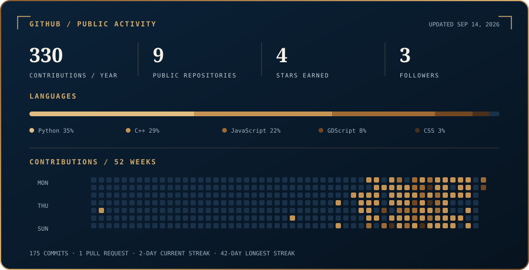

  <strong>Computer Science student at the University of the Philippines Cebu</strong> 
  I build practical software, data tools, and games—and I learn by finishing the unglamorous parts that make them usable.

  <a href="mailto:ghgabaisen@up.edu.ph">Email</a> ·
  <a href="https://linkedin.com/in/geo-ceff-vinzr-gabaisen-43214a339/">LinkedIn</a> ·
  <a href="https://leetcode.com/u/Vinzr/">LeetCode</a> ·
  <a href="https://github.com/GeoCeff?tab=repositories">All repositories</a>

## 01 — GitHub snapshot

  

Generated from GitHub's public account and repository data. Refreshed every Monday.

## 02 — Selected work

<table>
  <tr>
    <td width="50%" valign="top">
      <a href="https://github.com/GeoCeff/perk-the-star"><strong>Perk the Star</strong></a> 
      C++ · GODOT · GDSCRIPT  
      Orbital tower defense with rotating satellites, multiple game modes, persistent upgrades, and reusable systems implemented through GDExtension.
    </td>
    <td width="50%" valign="top">
      <a href="https://github.com/GeoCeff/stock-tester-and-simulator"><strong>Stock Research and Execution Workstation</strong></a> 
      PYTHON · STREAMLIT · MARKET DATA  
      Market research, backtesting, paper trading, portfolio risk, and guarded IBKR execution in one workspace. Invalid or stale research cannot approve an order.
    </td>
  </tr>
  <tr>
    <td width="50%" valign="top">
      <a href="https://github.com/GeoCeff/philippine-demographic-mapper"><strong>Philippine Demographic Mapper</strong></a> 
      JAVASCRIPT · GEOJSON · CSV  
      Local-first PSGC data validation and choropleth mapping with PNG and SVG export. <a href="https://geoceff.github.io/philippine-demographic-mapper/">Open the live app →</a>
    </td>
    <td width="50%" valign="top">
      <a href="https://github.com/GeoCeff/projectile-motion"><strong>Projectile Motion Lab</strong></a> 
      JAVASCRIPT · PHYSICS · VISUALIZATION  
      Interactive comparison of ideal motion and quadratic drag with live charts, presets, animation, and exports. <a href="https://geoceff.github.io/projectile-motion/">Run the simulation →</a>
    </td>
  </tr>
</table>

## 03 — Tools and approach

  <code>TypeScript</code> · <code>JavaScript</code> · <code>Python</code> · <code>C++</code> · <code>GDScript</code> · <code>SQL</code>  
  <code>React</code> · <code>React Native</code> · <code>Expo</code> · <code>Node.js</code> · <code>Streamlit</code> · <code>Godot</code>

I prefer small, understandable systems with clear defaults. I keep sensitive data local when possible, put irreversible actions behind explicit confirmation, and document a prototype's limits instead of pretending it is finished.

  BASED IN CEBU, PHILIPPINES · OPEN TO USEFUL OPEN-SOURCE COLLABORATIONS

