# Geo Ceff

  

Computer Science student at the University of the Philippines Cebu. I build practical software, data tools, and games.

I'm interested in mobile engineering, data visualization, simulation, automation, and game systems. I learn by building complete projects and working through the parts that make them usable: clear interfaces, validation, documentation, and sensible defaults.

## Selected work

- [**Perk the Star**](https://github.com/GeoCeff/perk-the-star) — A Godot 4.6 orbital tower-defense game with multiple modes and persistent upgrades. Its reusable systems are written in C++ through GDExtension, with GDScript coordinating gameplay and scenes.
- [**Stock Research and Execution Workstation**](https://github.com/GeoCeff/stock-tester-and-simulator) — A workspace for market research, backtesting, paper trading, portfolio risk, and guarded IBKR execution. Invalid or stale research outputs cannot approve an order.
- [**Philippine Demographic Mapper**](https://github.com/GeoCeff/philippine-demographic-mapper) — A local-first tool for joining PSGC-coded data to Philippine boundaries, reviewing data issues, and exporting choropleth maps. [Try the live app.](https://geoceff.github.io/philippine-demographic-mapper/)
- [**Projectile Motion Lab**](https://github.com/GeoCeff/projectile-motion) — An interactive physics lab that compares ideal motion with quadratic air resistance using live charts, presets, animation, and data export. [Run the simulation.](https://geoceff.github.io/projectile-motion/)

## Tools

TypeScript · JavaScript · Python · C++ · GDScript · SQL 
React · React Native · Expo · Node.js · Streamlit · Godot

## Contact

[Email](mailto:ghgabaisen@up.edu.ph) · [All repositories](https://github.com/GeoCeff?tab=repositories)
